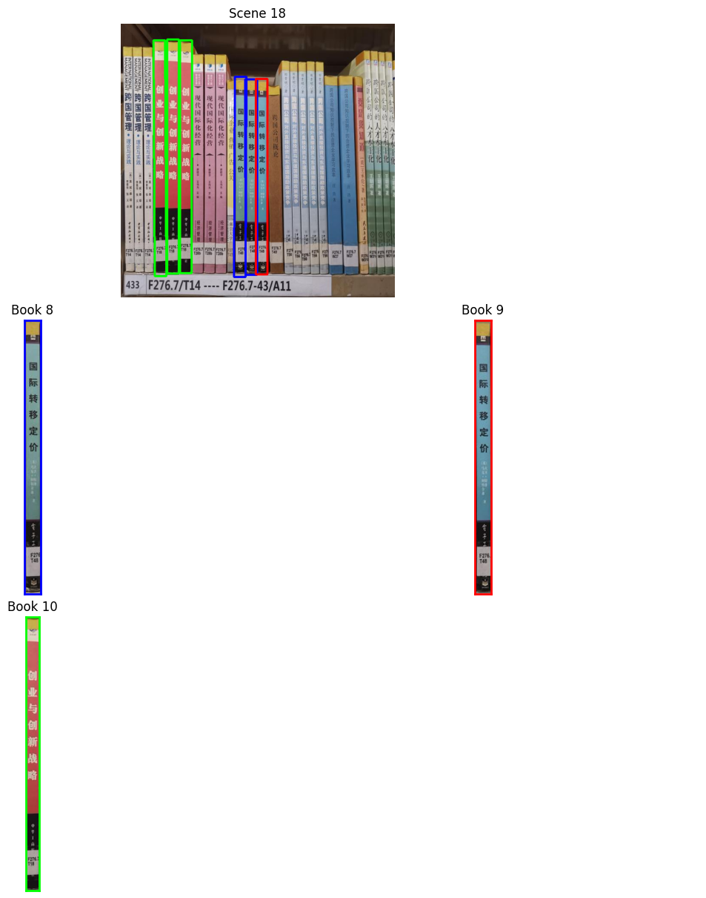
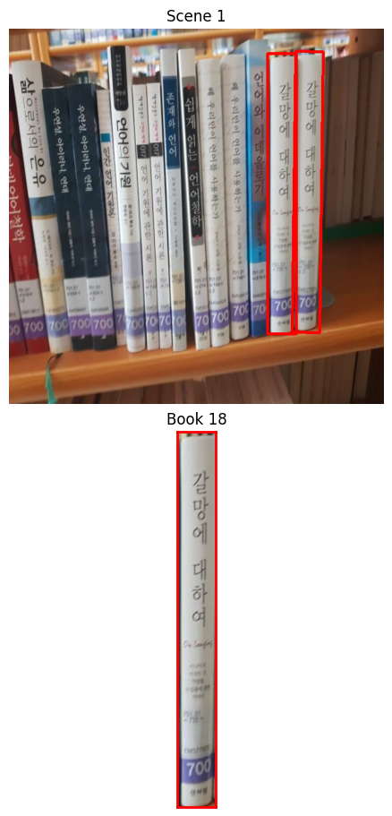

# SIFT + RANSAC Multi-Object Detection in Cluttered Scenes

A classical computer vision pipeline that localizes multiple known objects (book covers / product templates) inside cluttered, unconstrained scene photos — using SIFT feature matching, RANSAC-based homography estimation, and geometric plausibility checks, with no deep learning involved.

Given a small set of reference "model" images and a "scene" photo (e.g. a bookshelf), the system finds every instance of every model that appears in the scene, draws its location as a quadrilateral, and repeats until no further instances are found — while explicitly guarding against false positives from weak or geometrically implausible matches.

## Example output

<p align="center">
  
  <br><em>Three different reference books detected in a single scene (6 total instances) — each color-coded box corresponds to the matching thumbnail below it.</em>
</p>

<p align="center">
  
  <br><em>Two side-by-side copies of the same book, both correctly detected as separate instances thanks to the mask-based repeat-detection loop.</em>
</p>

Each detected instance is outlined directly on the scene, and the matched reference thumbnail is shown alongside it with a matching border color for easy visual verification.

## How it works

The pipeline runs in seven stages for each (model, scene) pair:

1. **Feature extraction (SIFT)** — keypoints and 128-d descriptors are extracted separately from the model and the scene, with slightly different contrast thresholds tuned to compensate for lighting differences between a clean template and a real photo.
2. **Descriptor matching (Brute-Force + kNN, k=2)** — candidate correspondences between model and scene keypoints.
3. **Lowe's ratio test** — ambiguous matches are discarded by requiring the best match to be meaningfully closer than the second-best.
4. **Match filtering** — a detection is only considered if it clears both an absolute and a relative match-count threshold, preventing spurious detections from a handful of accidental matches.
5. **Homography estimation (RANSAC)** — a projective transform from model to scene is fit robustly, discarding outlier correspondences.
6. **Model projection** — the model's four corners are projected into scene coordinates via the homography, producing a candidate quadrilateral.
7. **Geometric validation** — the candidate is rejected unless it is both convex and sufficiently "rectangular" (contour area / bounding-box area above a threshold), which filters out degenerate homographies before they're accepted as detections.

Multiple instances of the same model in one scene are found by repeating the process and masking out already-detected regions, so the same object is never counted twice.

## Key parameters

| Parameter | Value | Why |
|---|---|---|
| `sigma` (model / scene) | 0.4 | Low value to preserve fine detail on both templates and scene photos rather than smoothing it away |
| `contrastThreshold` (model / scene) | 0.025 / 0.024 | Slightly different per image type to balance keypoint density between clean templates and noisier scene photos |
| `lowes_ratio` | 0.75 | Standard balance between match precision and recall |
| `min_good_match` | 15 | Minimum absolute number of matches before a homography is even attempted |
| `min_match_percent` | 0.03 | Minimum matches as a fraction of all candidate matches — guards against "many matches but all noise" |
| `min_rectangularity` | 0.6 | Rejects warped/degenerate homographies whose projected shape doesn't look like a plausible rectangle |

## Repository structure

```
sift-ransac-object-detection/
├── README.md
├── requirements.txt
├── sift-ransac-object-detection.ipynb
├── dataset/                     # not included — see Data section
│   ├── models/                  # one reference image per object, model_0.png ... model_N.png
│   └── scenes/                  # cluttered scene photos, scene_0.jpg ... scene_N.jpg
└── assets/
    └── detection_examples/
        ├── scene_multi_book_detection.png
        └── scene_repeated_instances.png
```

> **Status:** README and example images are live. Still to add: `requirements.txt`, `LICENSE`, and cleaning the Colab-specific data-loading cell out of the notebook (see Usage below).

## Data

The pipeline expects two folders:
- `dataset/models/` — one clean reference image per object to detect
- `dataset/scenes/` — photos in which to search for those objects

This repo does not redistribute the original course dataset. To run the notebook, place your own `models/` and `scenes/` folders under `dataset/` following the same naming convention, and update `N_SCENES` / `N_MODELS` at the top of the notebook.

## Installation

```bash
git clone https://github.com/<your-username>/sift-ransac-object-detection.git
cd sift-ransac-object-detection
pip install -r requirements.txt
```

**requirements.txt**
```
opencv-contrib-python
numpy
matplotlib
```

> Note: SIFT requires `opencv-contrib-python` (not plain `opencv-python`) on older OpenCV versions where SIFT was non-free; on recent OpenCV (≥4.4) `opencv-python` alone also works.

## Usage

Open `sift-ransac-object-detection.ipynb` and run all cells. The final cell loops over every scene, runs detection against every model, and displays:
- the scene with all detected instances outlined
- a thumbnail grid of the matched reference models, color-coded to the outlines
- a printed summary of each detected instance's corner coordinates and area

> **Note:** the notebook currently loads data via `google.colab.drive.mount(...)`, since it was originally run on Colab. To run it locally, replace that cell with a plain path to your local `dataset/` folder (see Data section above) — everything downstream is standard OpenCV/NumPy and needs no other Colab-specific code.

## Limitations

- Relies on distinctive local texture — near-featureless or highly reflective object covers are harder to match reliably.
- Heavy occlusion (beyond what's shown in the examples) can drop the match count below the acceptance thresholds.
- Purely classical (no learned features), so performance depends entirely on hand-tuned parameters rather than learned robustness — a deliberate design constraint of the assignment, not a general limitation of the approach.

## Credits

Developed as a pair assignment for the Image Processing and Computer Vision course, University of Bologna, together with Ali Saleh Mohammadabad.

## License

MIT — see `LICENSE`.
